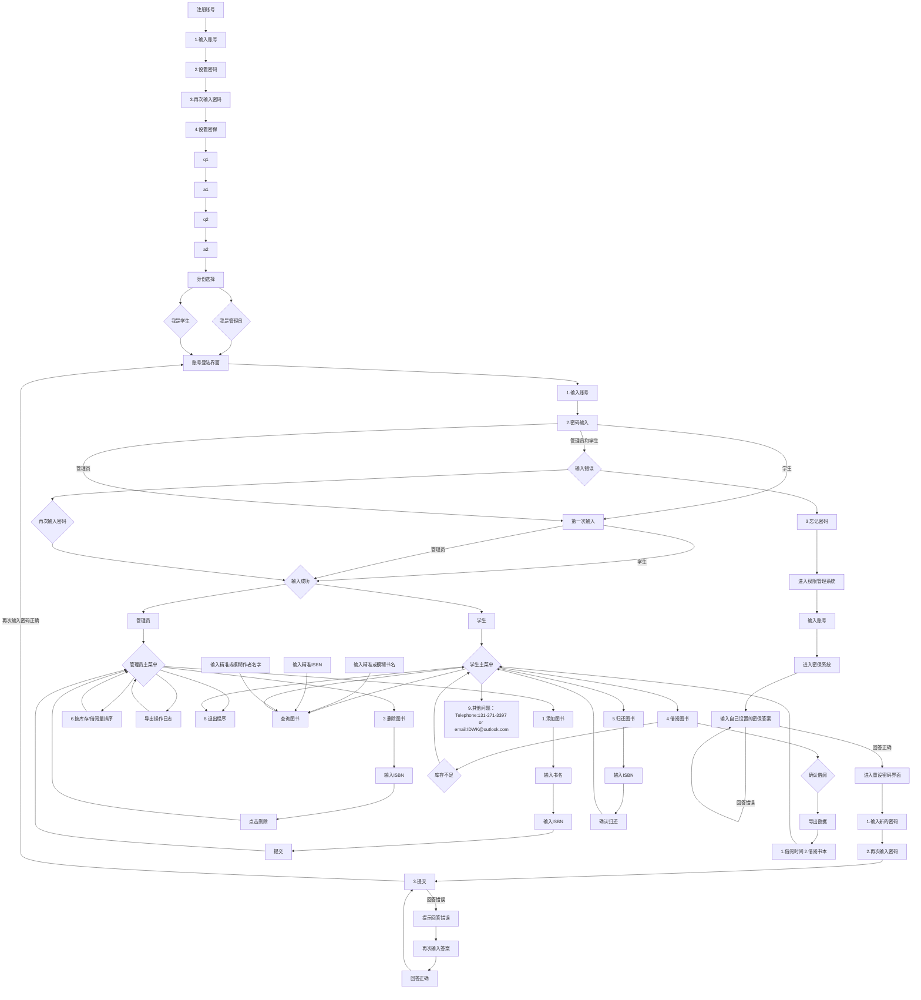

## 项目概述
- 开发一个基于控制台（或可选图形界面）的图书管理系统，实现对图书信息和借阅记录的基本管理功能，帮助用户高效地完成图书的录入、查询、借阅与归还等操作。

## 需求分析
### 1.1用户使用权限
管理员
- 增加图书
- 删除图书
- 按库存/借阅量排序
- 导出操作日志
- 退出程序

学生
- 查询图书
- 借阅图书
- 归还图书
- 导出数据(仅显示借阅时间和书本)
- 退出系统

### 1.2图书管理
- 添加、编辑、删除图书信息（书名、作者、ISBN）
- 支持按书名、作者、分类进行模糊搜索

### 1.3借阅与归还
- 借阅图书
	输入ISBN
		确认借阅
	库存不足返回主菜单
- 归还图书
	输入ISBN
		确认归还

### 1.4查询和排序
- 查询图书
	支持输入精准书名、ISBN、作者名字和模糊搜索书名、作者名字
- 按库存/借阅量排序
	 按库存量从少到多排序

### 1.5借阅记录管理
- 读者可查看自己的借阅历史（含未还与已还以及借阅时间和书本）

### 1.6用户管理
- 注册新用户（账号、密码）
- 设置密保
- 选择身份

## 架构设计
简易图书馆管理系统

|层级|职责|说明|
|---|---:|:---:|
|表示层|用户交互|控制台菜单、用户输入输出、提示信息|
|业户逻辑层|核心功能实现|图书管理、借归处理、增删处理、查询处理、排序处理、身份验证、数据导出|
|数据存储层|数据持久化|文件读写（JSON/CSV文本/二进制文件写入）|

## 数据结构设计
### 1.书本
|字段名|类型|说明|
|---|---:|:---:|
|book_id|字符串|ISBN|
|name|字符串|书名|
|author|字符串|作者名字|
|total_books|整数|库存量|
|borrow_books|整数|借阅量|

### 2.用户
|字段名|类型|说明|
|---|---:|:---:|
|role|枚举|身份选择（学生/管理员）|
|account|字符串|账号|
|code|字符串|密码|
|secret|字符串|密保|

### 3.借阅记录
|字段名|类型|说明|
|---|---:|:---:|
|borrow_date|日期|借书时间|
|return_date|日期|还书时间|
|book_id|字符串|关联图书编号|

### 4.操作日志
|字段名|类型|说明|
|---|---:|:---:|
|log_id|自增整数|日志ID|
|user|字符串|操作人|
|action|字符串|功能（如：添加图书、查询图书等）|
|target_id|字符串|操作对象ID(如：book_id)|
|timestamp|整数|操作时间|

## 模块设计
|模块|模块功能|模块之间的关系|
|---|---:|:---:|
|1.进入主界面|1.进入主程序 2.退出系统|是所有板块的起始|
|2.注册账号界面|1.输入账号 2.设置账号 3.再次输入密码 4.设置密保|板块1->板块2|
|3.身份选择|1.学生 2.管理员|板块2->板块3 板块3->板块4|
|4.账号登陆界面|1.学生账号 2.密码输入 3.忘记密码|板块3->板块4（除功能3）->板块8|
|5.权限管理系统|1.输入账号|板块4的忘记密码->板块5->板块6|
|6.密保系统|输入自己设置的密保答案|板块6->板块7|
|7.重设置密码界面|1.输入新的密码 2.再次输入新的密码 3.提交|板块7->板块4（除功能3）->板块8|
|8.主菜单|1.添加图书 2.查询图书（支持模糊搜索'书名'和'作者'、精准匹配'ISBN') 3.删除图书 4.借阅图书 5.归还图书 6.按库存/借阅量排序 7.导出数据（CSV/JSON） 8.退出系统 9.其他问题：Telephone:131-271-3397 or email:IDWK@outlook.com|整个系统的核心|

## 显示主界面
- ASCII艺术字用`#`打出OOKL(Ocean of Knowledege Library )—>在艺术字下方显示进入主程序、退出系统两个选项
![[video1.mp4]]

## 详细设计

## 测试用例设计
### 1.图书管理模块
|功能|输入数据/操作|预期结果|
|---|---:|:---:|
|添加图书|输入ISBN和书名|图书成功入库|
|删除图书|输入ISBN|图书成功出库|
|查询图书|精准输入书名/ISBN/作者名字或者模糊输入书名/作者名字|返回所有匹配图书列表|
|按库存/借阅量排序|管理员选择按“库存-->从少到多排序”|图书列表首项为最小值的图书|

### 2.用户管理模块
|功能|输入数据/操作|预期结果|
|---|---:|:---:|
|注册账号|输入账号、设置密码、设置密保|用户成功创建，开始选择身份|
|登陆账号|输入账号和密码|进入各身份主菜单|
|身份选择|选择管理员或者学生|进入账号登陆界面|
|设置密保|设置问题和答案|进入身份选择|

### 3.借还功能模块
|功能|输入数据/操作|预期结果|
|---|---:|:---:|
|借阅图书|输入书名或ISBN|成功借阅并导出借阅时间和书本的数据|
|归还图书|输入ISBN，点击确认归还|归还成功|

## 项目分工
| 成员     | 负责模块 | 具体任务                                    |
| -------- | -------- | ----------------------------------------- |
| 裴芯南 | `design.md`   | `设计文档`       |
| 覃文杰 | `logic.c`/`logic.h`和`data.c`/`data.h`和`store.c`/`store.h` |`数据容器：链表操作（`add_book`, `destroy_list`）业务逻辑：查询、排序、统计 文件接口：`log_loan`, `export_to_csv` `|
| 杨舒媛 | `main.c`  | 实现`用户界面和命令解析`       |